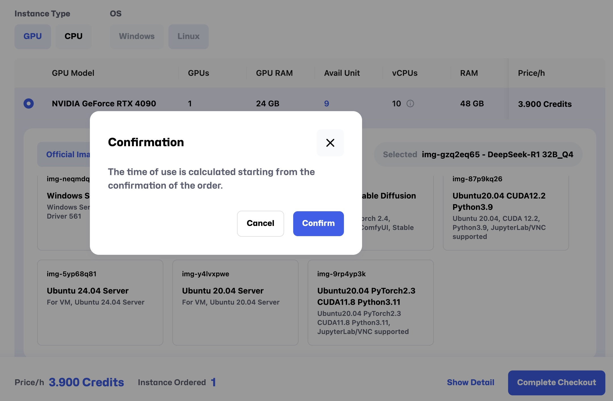

# Creating a New Instance

In this chapter, we will guide you on how to create a new instance on **Glows.AI**. Based on your project requirements, you can select either **GPU** or **CPU** models. Below are the detailed steps.

---

## **Step 1: Select Instance Type**

After navigating to the **Create New** page, the first step is to select the instance type:

- **GPU**: Select this option if you require AI training, large-scale data processing, or graphics-intensive tasks.
- **CPU**: Select this option if you prefer to debug the code on the CPU before switching to the GPU for training, or if your tasks require robust processing power without the need for GPU acceleration.

---

## **Step 2: Select GPU or CPU Model**

**GPU Model**:

- After selecting **GPU**, detailed specifications will be displayed, including:

  - **GPUs**: Number of GPUs available.
  - **GPU RAM**: Total memory of the GPU.
  - **CPU Model**: CPU model paired with the GPU.
  - **Avail Unit**: Number of units available for the selected GPU model.
  - **vCPUs**: Number of virtual CPUs associated with the GPU.
  - **RAM**: Total memory of the instance.
  - **Storage**: Available storage space.
  - **Price/h**: Hourly cost (in Credits).

**CPU Model**:

- After selecting **CPU**, you will see CPU-specific options only:
  - **Avail Unit**: Number of units available for the selected CPU model.
  - **vCPUs**: Number of virtual CPUs.
  - **RAM**: Memory of the instance.
  - **Storage**: Storage space of the instance.
  - **Price/h**: Hourly cost (in Credits).

---

## **Step 3: Select Official Image or Snapshot**

1. After selecting the GPU or CPU model, you can choose either `Official Image` or `Snapshot`:

   - **Official Image**: Provides a preconfigured environment for your instance.
   - **Snapshot**: Displays previously created instances saved as snapshots. Selecting a snapshot allows you to resume prior work environments and configurations, saving time on reconfiguration.

2. Once selected, the information of the chosen item will be displayed on the right:
   - **Selected Snapshot**: For example, `snp-7w9rgp6p - Test`.

---

## **Step 4: Set Unit Quantity**

**Unit Quantity**: Specifies the number of units required for the selected model. In our configuration, the "unit" represents a multiplier of the basic resources. One unit includes a set of predefined hardware parameters, such as GPU and VRAM. When users set the unit quantity, the system expands the resources based on the number of units. For example, setting it to 2 units will double the GPU and VRAM configuration of the base unit.

> Different parameters have their unit limits. Please adjust within the allowable range to ensure reasonable configurations.

---

## **Step 5: Mount Data Drive (Optional)**

1. If you need to mount a data drive, click the `Mount Data Drive` button and configure the following:

   - **Data Drive List**: Displays available drive options, including:
     - **Region** (e.g., 1).
     - **Usage**: Shows used and total capacity, e.g., **0/2GB**.
   - **Mount Path**: Default is **/datadrive** (currently not editable).
   - **Permissions**: Choose the drive's access permissions:
     - **Read only**.
     - **Read & write**.

2. After selection, the data drive mounting setup will be complete.

---

## **Step 6: Review Pricing and Instance Details**

After completing your configuration, a summary of your selections will be displayed at the bottom of the page:

- **Price/h**: Hourly cost of the selected instance.
- **Instance Ordered**: Number of instances you have ordered.
- **Show Detail**: Click this button to view detailed specifications of the selected model.

Example:

- **Price/h**: 6.500 Credits
- **Instance Ordered**: 1

---

## **Step 7: Complete Checkout**

After confirming the instance details and pricing, click `Complete Checkout` to finalize the order and create the instance.

---

## **Notes**

- **Mount Data Drive (Optional):**  
  Mounting a data drive is not mandatory. You can configure it after creating the instance. The system will not provide options if you have not rented and configured data drive storage. It is recommended that you complete these steps first (refer to the "Storage Configuration" chapter).

  > **Tip:** Instances without mounted data drives can still operate normally. Drives can be added later in the instance settings.

- **Snapshot Selection Restrictions:**  
  Only options successfully stored in the snapshot area will be displayed. If no snapshots are available, ensure you have completed the storage configuration on the "Storage Configuration" page and saved previously created instances as snapshots on the "My Instances" page.

- **Price Confirmation:**  
  Before completing the checkout, carefully review the total price, selected resource configurations, and required credits to ensure they meet your needs and expectations.

- **Data Permissions Setup:**  
  If you have mounted a data drive, select appropriate permissions (read-only or read-write) based on your use case.

---

Following the above steps, you will successfully create a new instance on **Glows.AI** and configure it according to your requirements. Next, we will guide you on how to manage and monitor your instances.
